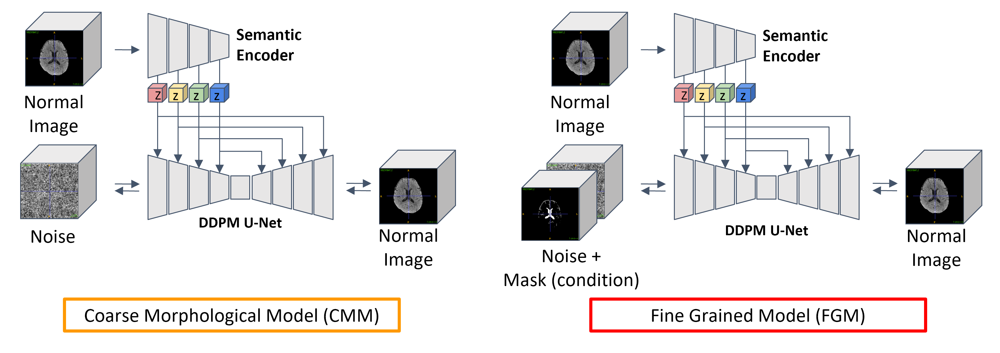
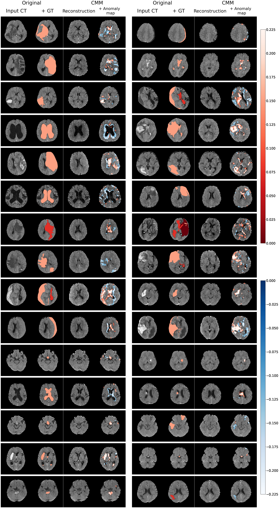

# Workload Reduction by using 3D Hierarchical DiffusionAutoencoder
This is the codebase for the paper "Generative Unsupervised Anomaly Detection with Coarse-Fine Ensemble for Workload Reduction in 3D Non-contrast Brain CT of Emergency Room".

This repository is composed of model "Coarse-Morphological-Model (CMM)" & "Fine-Grained-Model (FGM)"  

Our code parts are mainly in "CMM" and "FGM" illustrated below: 



<br/>

This repository is based on MONAI.

[Monai Generative Models](https://github.com/Project-MONAI/GenerativeModels/tree/main/generative)
<br/>

## requirements
```bash
pip install -r requirements.txt
```
<br/>


# Train & Test

There are directories for each upstream model and downstream task. 
<br/>

### Train: 
For the training stage of CMM & FGM models. 

CMM
```bash
python main.py --batch_size <batch_size> --log_dir <log_dir> -image_size 96
```
<br/>

FGM
```bash
python main_seg.py --batch_size <batch_size> --log_dir <log_dir> -image_size 256
```
<br/>

### Test: 
For the testing stage of CMM & FGM models. 

CMM
```bash
python inference.py --session <inference_dataset_categry> -image_size 96
```
<br/>

FGM
```bash
python inference.py --session <inference_dataset_categry> -image_size 256
```
<br/>

# Anomaly Cases of CMM



# Anomaly Cases of FGM


